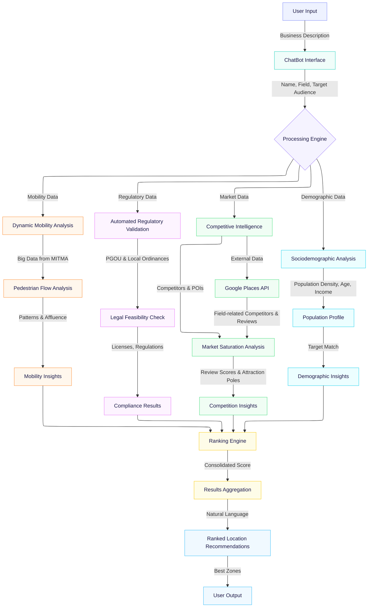

```mermaid
---
config:
  layout: elk
---
%% ============================================================================
%% DIAGRAMA DE FLUJO ARQUITECTÓNICO (Geo-Yield-AI)
%% ============================================================================
%% Este diagrama modela el flujo de procesamiento de datos de la plataforma.
%% Refleja un patrón "Fan-Out / Fan-In" (Despliegue y Concentración): 
%% - Fan-Out: Una sola petición se divide en 4 ramas de análisis paralelo.
%% - Fan-In: Los resultados se agregan y procesan para dar un informe único.

graph TD
    %% --- CAPA DE INTERFAZ (Front-End) ---
    A[User Input] -->|Business Description| B[ChatBot Interface]
    B -->|Name, Field, Target Audience| C{Processing Engine}
    
    %% --- CAPA DE ANÁLISIS EN PARALELO (Fan-Out) ---
    %% Rama 1: Análisis de Movilidad
    C -->|Mobility Data| D[Dynamic Mobility Analysis]
    D -->|Big Data from MITMA| E[Pedestrian Flow Analysis]
    E -->|Patterns & Affluence| F1[Mobility Insights]
    
    %% Rama 2: Cumplimiento Normativo (RAG)
    C -->|Regulatory Data| G[Automated Regulatory Validation]
    G -->|PGOU & Local Ordinances| H[Legal Feasibility Check]
    H -->|Licenses, Regulations| F2[Compliance Results]
    
    %% Rama 3: Análisis Sociodemográfico
    C -->|Demographic Data| I[Sociodemographic Analysis]
    I -->|Population Density, Age, Income| J[Population Profile]
    J -->|Target Match| F3[Demographic Insights]
    
    %% Rama 4: Inteligencia Competitiva
    C -->|Market Data| K[Competitive Intelligence]
    %% Se integra una API externa (Google Places) para enriquecer el contexto local.
    K -->|External Data| GP[Google Places API]
    GP -->|Field-related Competitors & Reviews| L[Market Saturation Analysis]
    K -->|Competitors & POIs| L
    L -->|Review Scores & Attraction Poles| F4[Competition Insights]
    
    %% --- CAPA DE SÍNTESIS Y SALIDA (Fan-In) ---
    F1 --> M[Ranking Engine]
    F2 --> M
    F3 --> M
    F4 --> M
    
    M -->|Consolidated Score| N[Results Aggregation]
    N -->|Natural Language| O[Ranked Location Recommendations]
    O -->|Best Zones| P[User Output]
    
    %% --- SISTEMA DE DISEÑO (Colores y Estilos por Dominio) ---
    style A fill:#eef2ff,stroke:#818cf8,color:#1e1b4b
    style B fill:#f0fdfa,stroke:#2dd4bf,color:#1e1b4b
    style C fill:#f5f3ff,stroke:#a78bfa,color:#1e1b4b
    
    %% Rama Naranja: Movilidad
    style D fill:#fff7ed,stroke:#fb923c,color:#1e1b4b
    style E fill:#fff7ed,stroke:#fb923c,color:#1e1b4b
    style F1 fill:#fff7ed,stroke:#fb923c,color:#1e1b4b
    
    %% Rama Rosa: Normativa
    style G fill:#fdf4ff,stroke:#e879f9,color:#1e1b4b
    style H fill:#fdf4ff,stroke:#e879f9,color:#1e1b4b
    style F2 fill:#fdf4ff,stroke:#e879f9,color:#1e1b4b
    
    %% Rama Azul: Demografía
    style I fill:#ecfeff,stroke:#22d3ee,color:#1e1b4b
    style J fill:#ecfeff,stroke:#22d3ee,color:#1e1b4b
    style F3 fill:#ecfeff,stroke:#22d3ee,color:#1e1b4b
    
    %% Rama Verde: Competencia
    style K fill:#f0fdf4,stroke:#4ade80,color:#1e1b4b
    style L fill:#f0fdf4,stroke:#4ade80,color:#1e1b4b
    style GP fill:#f0fdf4,stroke:#4ade80,color:#1e1b4b
    style F4 fill:#f0fdf4,stroke:#4ade80,color:#1e1b4b
    
    %% Agregación Final
    style M fill:#fefce8,stroke:#facc15,color:#1e1b4b
    style N fill:#fefce8,stroke:#facc15,color:#1e1b4b
    style O fill:#f0f9ff,stroke:#38bdf8,color:#1e1b4b
    style P fill:#f0f9ff,stroke:#38bdf8,color:#1e1b4b
```